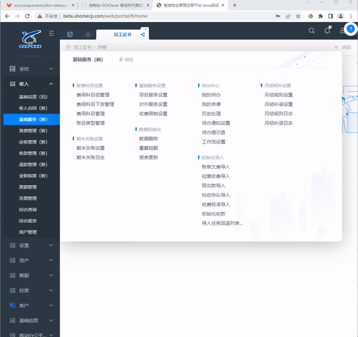
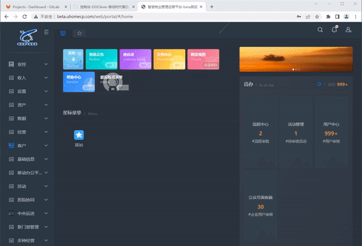
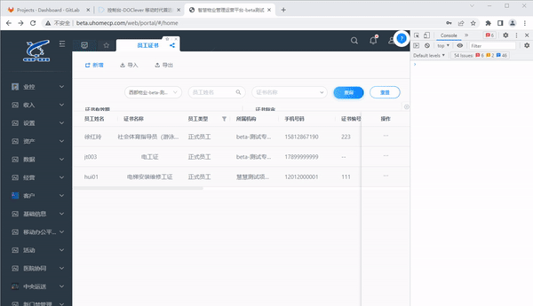
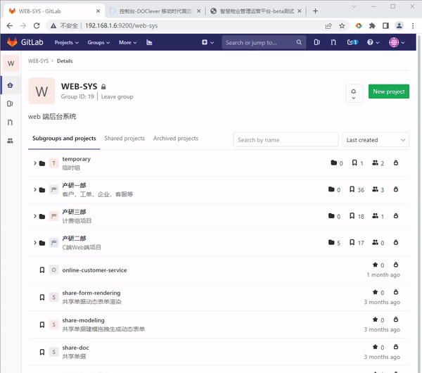
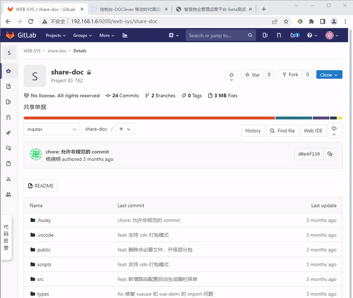
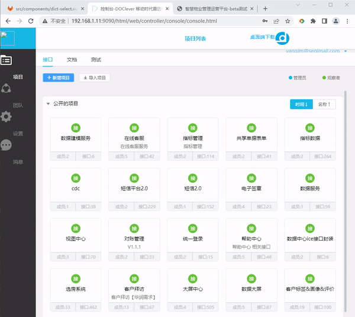

  
  <h1>四格开发助手浏览器扩展</h1>
  
一个用于四格互联内部使用的开发助手浏览器扩展

  

    
    
    
  

## 目录

- [目录](#目录)
- [介绍](#介绍)
- [安装教程](#安装教程)
  - [在线安装](#在线安装)
  - [本地安装](#本地安装)
- [使用小技巧](#使用小技巧)
  - [开关某个功能](#开关某个功能)
  - [全局搜索小技巧](#全局搜索小技巧)
- [贡献](#贡献)
- [License](#license)

## 介绍

**四格开发助手浏览器扩展** 是一个用于四格内部提高开发效率的浏览器扩展。

它支持 `chrome` 和 `edge` 浏览器，它拥有以下功能：

1、在浏览 `uhomecp` 时，可以鼠标 hover 菜单并预览菜单。
 
 

 
 
 
2、在浏览 `uhomecp` 时，可以按 `ctrl + k` 键呼出全局搜索，可以根据菜单名字或菜单 url 搜索菜单。
 
 

 
 
 
3、在浏览 `uhomecp` 时，可以按点击顶部 tab 左侧分享 icon 复制分享代码给队友打开同样的 tab。
 
 

 
 
 
4、在浏览 `gitlab` 时，可以按 `ctrl + k` 呼出全局搜索，可以搜仓库或当前仓库文件。
 
 

 
 
 
5、在浏览 `gitlab` 某个仓库时，会在左侧生成文件侧栏树，方便浏览文件，并且使用 `vscode` 同款染色代码，可以点击侧栏左上角固定侧栏或全屏浏览代码
 
 

 
 
 
6、在浏览 `doclever api` 平台时，可以按 `ctrl + k` 键呼出全局搜索，可以根据接口名字或接口 url 搜索接口。
 
 

 
 
 

## 安装教程

### 在线安装

即将推出......（快了快了，进度 0%）

### 本地安装

1、 点击[这里](https://github.com/2214962083/segi-helper-browser-extensions/releases/latest/download/extension.zip)下载本扩展压缩包

2、 打开浏览器浏览器扩展管理页面。你可以在菜单里打开，也可以输入 `chrome:extensions` 打开扩展页面

3、打开扩展页面里的开发者模式开关，把刚刚下载的 zip 拖入扩展页面即可安装。

## 使用小技巧

### 开关某个功能

你可以固定本扩展小图标到浏览器右上角，并且点击小图标即可开启或关闭某个功能。

### 全局搜索小技巧

1、可以按 `ctrl + k` 呼出全局搜索

2、可以按 `tab` 键向右切换搜索 tab

3、可以按 `shift + tab` 键向左切换搜索 tab

4、可以按上下键在搜索结果移动

5、可以按 `enter` 键确认选择搜索结果

6、再次按 `ctrl + k` 可以关闭全局搜索

## 贡献

点[这里](https://github.com/2214962083/segi-helper-browser-extensions/blob/master/CONTRIBUTING.md)了解如何贡献。

感谢为这个项目贡献的所有人：

## License

[MIT](https://github.com/2214962083/segi-helper-browser-extensions/blob/master/LICENSE) License © 2022-PRESENT [yangjinming](https://github.com/2214962083)
